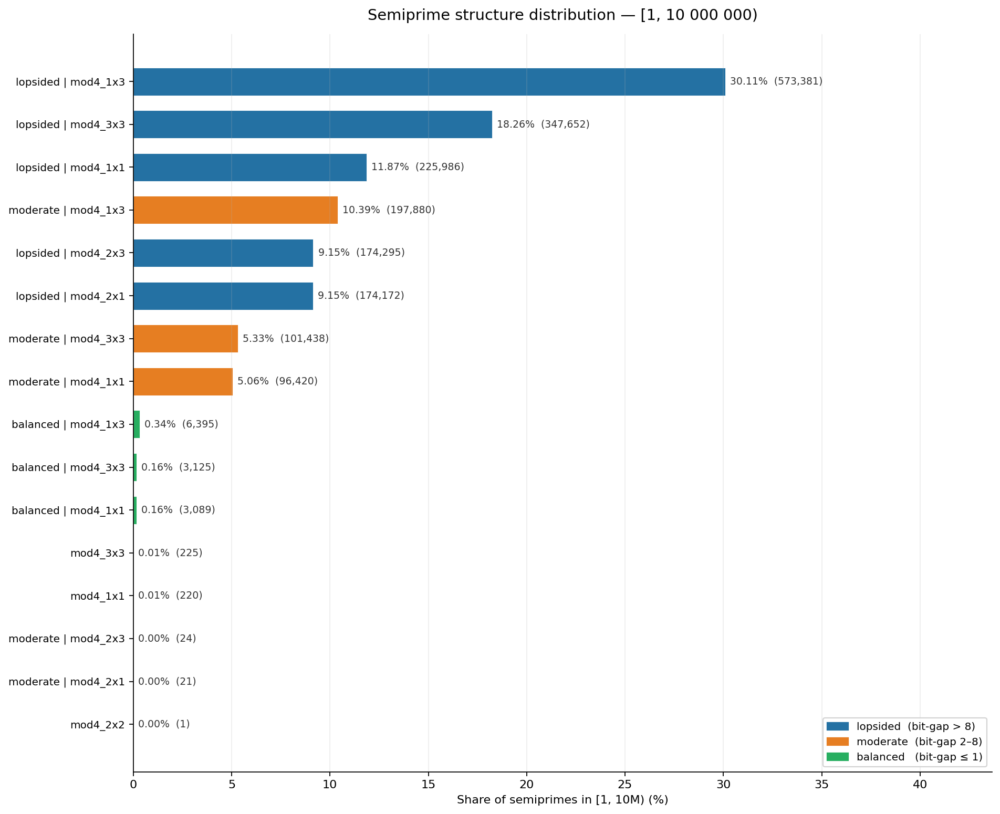

# primehelix

[](https://pypi.org/project/primehelix/)
[](https://pypi.org/project/primehelix/)
[](https://github.com/onojk/primehelix/actions/workflows/ci.yml)
[](LICENSE)

**primehelix shows how structural constraints reshape integer distributions — beyond what naive prime-counting predicts.**

Every integer receives a compact **structure label** encoding classification, geometric balance, and residue-family membership into one token: `semiprime | lopsided | mod4_1x3`. Those labels are the common currency across all five commands: classify one number, scan a million, compare two ranges, track trends over time.

---

## Findings



At 10M scale: **~79% of semiprimes are lopsided** (factors differ by more than 8 bits). Balanced, RSA-like semiprimes — where both factors have nearly equal bit-length — account for less than 1%. The bias compounds with scale: it was 73% at 1M and grows stronger, not weaker, as the range increases.

All measurements below come from scanning [1, 1 000 000). Every command shown is fully reproducible.

**At 1M scale:** ~73% of semiprimes are lopsided. At 10M that rises to ~79%. Balanced (RSA-like) semiprimes fall below 0.7%. The even-involved share nearly doubles under the lopsided constraint. This distribution strengthens — not randomizes — as the range grows.

### Lopsided semiprimes dominate — and grow more dominant with range

In [1, 1M), semiprimes break into three balance tiers:

| Balance tier | Share |
|--------------|------:|
| lopsided (factors differ by > 8 bits) | **73.2%** |
| moderate | 25.9% |
| balanced (RSA-like — factors nearly equal bit-length) | 0.80% |

Balanced semiprimes are rarer than 1 in 125. The bias compounds: at 10M scale lopsided share reaches **78.5%** and balanced falls to **0.66%**. As range grows, lopsided pairs gain share and moderate ones shrink — consistently across every mod4 residue family:

| Structure | delta [1,500k) → [500k,1M) | delta [1,5M) → [5M,10M) |
|-----------|---------------------------:|------------------------:|
| semiprime \| lopsided \| mod4_1x3 | +2.69% | +1.83% |
| semiprime \| moderate \| mod4_1x3 | −2.05% | −1.39% |
| semiprime \| lopsided \| mod4_3x3 | +1.51% | +0.89% |
| semiprime \| moderate \| mod4_3x3 | −1.39% | −0.82% |

The mechanism: small primes (2, 3, 5, 7, …) are reused repeatedly as the smaller factor of larger and larger semiprimes, widening the bit-gap with every step. The effect is self-reinforcing and does not saturate.

### The lopsided constraint shifts residue families

Applying a structural constraint (lopsidedness) measurably distorts residue-family distribution:

Filtering to lopsided semiprimes changes the mod4 pair distribution in a predictable direction:

| Mod4 pair | All semiprimes | Lopsided only | Shift |
|-----------|---------------:|-------------:|------:|
| mod4_1x3 (mixed families) | 40.0% | 36.4% | −3.6 pp |
| mod4_3x3 (both gaussian) | 23.7% | 22.9% | −0.9 pp |
| mod4_1x1 (both pythagorean) | 16.4% | 13.7% | −2.7 pp |
| even-involved (factor of 2) | 19.8% | **27.0%** | **+7.2 pp** |

The lopsided bucket absorbs all 2×p semiprimes — 2 paired with a large prime is always lopsided. This inflates the even-involved share and compresses every odd pair class.

### Primes split evenly by residue family

Among 78,498 primes in [1, 1M): 50.09% gaussian (p ≡ 3 mod 4), 49.91% pythagorean (p ≡ 1 mod 4). The near-perfect symmetry is consistent with Dirichlet's theorem and stable across ranges.

```bash
primehelix structure-scan --start 1 --stop 1000000 --json
primehelix compare-ranges --a-start 1 --a-stop 500000 --b-start 500000 --b-stop 1000000 \
  --only-classification semiprime --top-delta 6 --json
```

---

## Datasets

Pre-computed results are in [`datasets/`](datasets/):

| File | Range | Count |
|------|-------|------:|
| [`semiprime_1e6_labels.csv`](datasets/semiprime_1e6_labels.csv) | [1, 1M) | 210,035 semiprimes, 16 labels |
| [`semiprime_1e7_labels.csv`](datasets/semiprime_1e7_labels.csv) | [1, 10M) | 1,904,324 semiprimes, 16 labels |
| [`compare_semiprime_1e6_halves.csv`](datasets/compare_semiprime_1e6_halves.csv) | [1,500k) vs [500k,1M) | per-label deltas |
| [`compare_semiprime_1e7_halves.csv`](datasets/compare_semiprime_1e7_halves.csv) | [1,5M) vs [5M,10M) | per-label deltas |

Each file includes exact CLI commands to reproduce it. See [`datasets/README.md`](datasets/README.md).

---

## Install

```bash
pip install primehelix                # core: classify, factor, scan, compare
pip install 'primehelix[plot]'        # add matplotlib for --plot
```

On Linux, install GMP first for full performance (gmpy2):
```bash
sudo apt install libgmp-dev libmpfr-dev libmpc-dev
pip install primehelix
```

---

## Commands

Core workflow: **classify** one number → **scan** a range → **compare** two ranges → **track** structure over time.

### `classify` — inspect one integer

```bash
primehelix classify 1300039
primehelix classify 1300039 --helix       # ASCII double-helix visualization
primehelix classify 1300039 --coil        # geometric footprint metrics
primehelix classify 1300039 --residue     # full residue profile
primehelix classify 1300039 --json        # machine-readable output
```

**`--helix` output** (1300039 = 13 × 100003, bit_gap=13):

```
1300039 → semiprime

Helix (p=13, q=100003)
balance=87.696, bit_gap=13

                      +-------------------*
                     +                     *
                     *---------------------+
                        *               +
                            +~~~~~~~*
                                +
```

The `+` strand is the small factor (13). The `*` strand is the large factor (100003). The shape encodes how the two factors relate in size:

- **Strand separation** reflects the bit-gap — how many binary digits separate the two factors. bit_gap=13 means 100003 is roughly 2¹³ times larger than 13. Wide strands = lopsided.
- **Balance score** (87.696) is the log-ratio of the two factors. A balanced RSA-like semiprime (e.g. 997 × 1009) produces a tight helix where strands nearly touch. This one is far apart.
- **The `~` region** marks where the two strands are geometrically closest — the pinch point of the coil.

A wide, open helix means lopsided. A compressed helix means balanced. This is the same information the structure label encodes as text (`lopsided`, `moderate`, `balanced`) — the helix makes it visible instead of named.

**`--json` output:**

```json
{
  "command": "classify",
  "n": 1300039,
  "classification": "semiprime",
  "factors": {"13": 1, "100003": 1},
  "factorization": "13 * 100003",
  "method": "trial",
  "complete": true,
  "structure": "semiprime | lopsided | mod4_1x3",
  "residue": {
    "semiprime_mod4_pair": "1x3",
    "semiprime_mod4_note": "mixed 1 mod 4 and 3 mod 4 factor families",
    "factor_families_mod4": ["pythagorean", "gaussian"]
  }
}
```

---

### `factor` — full factoring pipeline

```bash
primehelix factor 2147483646
primehelix factor 2147483646 --verbose    # show pipeline steps
primehelix factor 2147483646 --json --verbose
```

**Pipeline:** trial division → Pollard p−1 → Williams p+1 → Pollard Rho (Brent) → Lenstra ECM → Quadratic Sieve

Primality testing uses **Baillie–PSW** — deterministic for all 64-bit integers. `complete: true` means every factor is proven prime.

---

### `structure-scan` — count structure labels across a range

```bash
primehelix structure-scan --start 1 --stop 1000000
primehelix structure-scan --start 1 --stop 1000000 --only-classification semiprime
primehelix structure-scan --start 1 --stop 1000000 --profile   # show method distribution
primehelix structure-scan --start 1 --stop 1000000 --json
```

Scans every integer in `[start, stop)`, assigns a structure label, returns counts, histogram, and Shannon entropy of the distribution. Progress shown on stderr for ranges over 10,000.

---

### `compare-ranges` — diff structure distributions

```bash
primehelix compare-ranges \
  --a-start 1 --a-stop 500000 \
  --b-start 500000 --b-stop 1000000 \
  --only-classification semiprime --top-delta 6
```

Shows which structure labels gained or lost share between two ranges, with delta, ratio, and per-range entropy.

---

### `structure-time-series` — track structural trends over sliding windows

```bash
primehelix structure-time-series \
  --start 1 --stop 1000000 \
  --window 100000 --step 100000 \
  --only-classification semiprime \
  --top 5 \
  --plot semiprime_ts.png
```

Divides `[start, stop)` into windows, computes structure distributions in each, and plots the top-N label series as a line chart. Omit `--plot` for a text summary.

---

## Python API

All analysis functions work as a library — no CLI required. Results are typed dataclasses.

```python
from primehelix.analysis import scan_range, compare_summaries, build_time_series

# Scan a range and inspect label counts
scan = scan_range(1, 100_000)
print(scan.total)                        # total integers counted
print(scan.counts.most_common(5))        # top 5 structure labels

# Compare two ranges — see which labels gained or lost share
s1 = scan_range(1, 500_000, only_classification="semiprime")
s2 = scan_range(500_000, 1_000_000, only_classification="semiprime")
rows = compare_summaries(s1, s2)
for row in sorted(rows, key=lambda r: -abs(r.delta))[:5]:
    print(f"{row.delta:+.2f}pp  {row.structure}")

# Track structure trends across windows
ts = build_time_series(1, 1_000_000, window=100_000, step=100_000,
                       only_classification="semiprime")
for label in ts.top_labels:
    print(label, ts.series_map[label])

# Export results directly from the API
import json
with open("scan.json", "w") as f:
    json.dump({"start": 1, "stop": 100_000, **scan.to_json_dict()}, f, indent=2)
```

Use `detail="classification"` for fast classification-only counts (no geometry, ~10% faster):

```python
scan = scan_range(1, 10_000_000, only_classification="prime", detail="classification")
print(scan.total)   # prime count in [1, 10M) — no residue family breakdown
```

---

## Structure labels

Every integer gets a label of up to three parts joined by ` | `:

```
semiprime | lopsided | mod4_1x3
prime | gaussian
composite
invalid
```

| Part | What it encodes |
|------|----------------|
| Classification | `prime`, `semiprime`, `composite`, `invalid` |
| Balance | `balanced`, `moderate`, `lopsided` — bit-length gap between factors; semiprimes only |
| Residue family | `mod4_1x3`, `mod4_3x3`, `pythagorean`, `gaussian`, etc. |

Labels are **stable strings** — safe to grep, aggregate, diff between ranges, and use as dict keys across runs. The grammar is fixed: classification first, balance second (when present), residue family last.

---

## JSON schema

All commands support `--json`. The schema is stable across patch versions.

**`classify` and `factor`:**

| Field | Present in | Notes |
|-------|-----------|-------|
| `command` | both | `"classify"` or `"factor"` |
| `n` | both | integer |
| `classification` | classify | `"prime"`, `"semiprime"`, `"composite"`, `"invalid"` |
| `factors` | both | `{"p": exponent, ...}` |
| `prime_factors` | both | flat list, e.g. `[3, 3, 7]` for 3²×7 |
| `factorization` | both | `"2 * 3^2 * 7"` (ASCII) |
| `method` | both | last algorithm used |
| `elapsed_ms` | both | wall time in milliseconds |
| `complete` | both | `true` if all factors proven prime |
| `structure` | classify | compact label string |
| `steps` | factor with `--verbose` | pipeline step trail; `[]` otherwise |
| `coil` | classify with `--coil` | geometric footprint + insight string |
| `residue` | classify | mod4/mod6/mod30 profile |

**`structure-scan` and `compare-ranges`:**

| Field | Notes |
|-------|-------|
| `entropy` | Shannon entropy (bits) of label distribution — 0 = single label, log₂(k) = uniform |
| `a.entropy`, `b.entropy` | per-range entropy in compare-ranges |
| `entropy_delta` | `b.entropy − a.entropy`; positive = B more structurally diverse |
| `methods` | factorization method counts (structure-scan with `--profile`) |

Breaking changes will be documented in release notes with a minor version bump.

---

## Guarantees and limits

**Deterministic:** Structure labels are computed from factorization alone — identical input always produces identical output. Baillie–PSW is deterministic for all integers up to 2⁶⁴.

**May time out:** The factoring pipeline has a configurable budget (`--budget`, default 10 000 ms). Hard numbers may return `complete: false` with a partial factorization.

**Stable and scriptable:** `classify`, `structure-scan`, `compare-ranges`, and `structure-time-series` with `--json` produce output safe to pipe, grep, and aggregate across runs.

**Experimental:** `--coil` and `--helix` geometry output is under active development. Coordinate values and balance thresholds may change between minor versions. Do not parse `coil.insight` strings programmatically.

---

## Develop and test

```bash
git clone https://github.com/onojk/primehelix.git
cd primehelix
python3 -m venv .venv && source .venv/bin/activate
pip install -e ".[dev]"
pytest tests/ -v
```

---

## Architecture

```
primehelix/
├── cli.py                  — 5 Click commands + scan helpers
├── core/
│   ├── primes.py           — Baillie-PSW (Miller-Rabin + strong Lucas PRP)
│   ├── factor.py           — Pipeline orchestration
│   ├── rho.py              — Pollard Rho (Brent, batch-GCD)
│   ├── pm1.py              — Pollard p−1 / Williams p+1
│   ├── ecm.py              — Lenstra ECM (pure Python + gmpy2)
│   └── qs.py               — Quadratic Sieve (GF(2) left nullspace)
├── geometry/
│   ├── coil.py             — Conical helix model, CoilFootprint, CoilBalance
│   ├── residue.py          — Mod4/mod6/mod30 residue profiling
│   ├── bitbucket.py        — Bit-bucket placement and density
│   └── tangent.py          — Equal/tangent/ideal split diagnostics
├── display/
│   ├── output.py           — Rich terminal panels and tables
│   ├── json_output.py      — JSON schema, structure_summary label builder
│   ├── plots.py            — Matplotlib time-series line charts
│   └── ascii_helix.py      — ASCII double-helix renderer
└── scan/
    └── wheel.py            — Mod-210 wheel scanner, resumable gzip CSV
```

primehelix consolidates five research repositories: `geom_factor` (Quadratic Sieve, geometric model), `rsacrack` (factoring pipeline, coil classifier), `ECC-Tools` (ECM reference), `Cprime` (GMP-backed CLI), `onojk123` (wheel scanner, tangent prime test).

---

Integer structure is not uniformly distributed — it is shaped by reusable factor patterns and structural constraints that produce stable, predictable statistical behavior. primehelix makes that behavior visible and measurable.

## Author

Jonathan Kendall — https://github.com/onojk

## License

MIT
